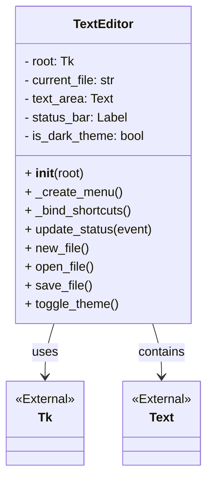
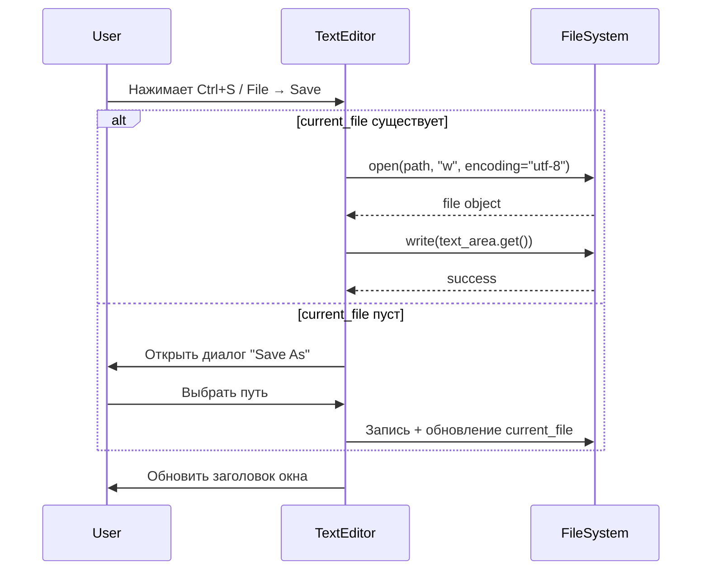

# Техническое руководство: Создание текстового редактора на Python

> **Цель документа:** Пошаговое руководство для начинающих разработчиков по созданию GUI-приложения «Текстовый редактор» на Python с использованием встроенной библиотеки `tkinter`. Включает исследование предметной области, архитектуру, реализацию творческих модификаций и документацию процесса.

---

## 1. Исследование предметной области

Прежде чем писать код, мы провели анализ требований к простому текстовому редактору и выбрали подходящий стек технологий.

### 🔍 Ключевые вопросы исследования:
1. **Какие компоненты обязательны для текстового редактора?**
   - Графическое окно (GUI)
   - Многострочное текстовое поле с поддержкой прокрутки
   - Система меню (File, Edit, Help)
   - Диалоги открытия/сохранения файлов
   - Обработка кодировок (UTF-8)
2. **Почему выбран `tkinter`?**
   - Встроен в стандартную библиотеку Python (не требует `pip install`)
   - Кроссплатформенность (Windows, macOS, Linux)
   - Простая событийная модель (`bind`, `command`)
   - Идеален для учебных проектов и быстрого прототипирования
3. **Анализ аналогов:** Изучены открытые проекты из репозитория [codecrafters-io/build-your-own-x](https://github.com/codecrafters-io/build-your-own-x), выделены базовые паттерны MVC для GUI-приложений.

### 📊 Таблица: Сравнение GUI-библиотек Python
| Библиотека | Сложность | Зависимости | Кроссплатформенность | Подходит для новичков |
|------------|-----------|-------------|----------------------|-----------------------|
| `tkinter`  | Низкая    | Встроена    | ✅ Да                | ✅ Да                 |
| `PyQt5/6`  | Средняя   | Внешние     | ✅ Да                | ❌ Нет                |
| `CustomTkinter` | Низкая | Внешние  | ✅ Да                | ✅ Да (надстройка)    |
| `Kivy`     | Высокая   | Внешние     | ✅ Да (мобильные)    | ❌ Нет                |

---

## 2. Подготовка окружения

### ✅ Требования:
- Python 3.7+ (в проекте используется `3.12.3`)
- ОС: Linux Mint / Windows / macOS
- Git для контроля версий

### 📦 Проверка установки:
```bash
python3 --version   # Должно вывести Python 3.x
python3 -m tkinter  # Откроется тестовое окно Tk (закрыть крестиком)
git --version       # Должно вывести git version 2.x

> ⚠️ **Для Linux (Ubuntu/Mint):** если `tkinter` отсутствует, установите: `sudo apt install python3-tk`

---

## 🧱 3. Пошаговая реализация

### Шаг 1: Создание базового окна
```python
import tkinter as tk

root = tk.Tk()
root.title("Simple Python Text Editor")
root.geometry("800x600")
root.mainloop()
```
  

### Шаг 2: Добавление текстового поля
```python
text_area = tk.Text(root, wrap="word", undo=True, font=("Consolas", 12))
text_area.pack(expand=True, fill="both")
```
- `wrap="word"` — перенос по словам, а не по символам
- `undo=True` — встроенная поддержка Ctrl+Z
- `expand=True, fill="both"` — растягивание на всё окно

### Шаг 3: Система меню и файловые операции
```python
from tkinter import filedialog, messagebox
import os

def open_file():
    path = filedialog.askopenfilename(filetypes=[("Text Files", "*.txt"), ("All Files", "*.*")])
    if path:
        with open(path, "r", encoding="utf-8") as f:
            text_area.delete(1.0, tk.END)
            text_area.insert(1.0, f.read())

menu = tk.Menu(root)
root.config(menu=menu)
file_menu = tk.Menu(menu, tearoff=False)
menu.add_cascade(label="File", menu=file_menu)
file_menu.add_command(label="Open", command=open_file, accelerator="Ctrl+O")
root.bind("<Control-o>", lambda e: open_file())
```
> 💡 **Важно:** Всегда указывайте `encoding="utf-8"` при работе с текстом, чтобы избежать ошибок `UnicodeDecodeError` на Windows/Linux.

### Шаг 4: Полная архитектура приложения
Мы объединили все компоненты в ООП-класс `TextEditor` для изоляции состояния и упрощения расширения. Полный код находится в `src/text_editor.py`.

---

## 🏗 4. Архитектура и визуализация

### 📐 UML Class Diagram


### 🔄 Sequence Diagram: Процесс сохранения файла


### 📊 Таблица: Связь компонентов и событий
| Компонент | Событие | Обработчик | Результат |
|-----------|---------|------------|-----------|
| `text_area` | `<KeyRelease>` | `update_status()` | Обновление строки состояния |
| `File → Open` | `command` | `open_file()` | Чтение файла, вставка в буфер |
| `Ctrl+T` | `<Control-t>` | `toggle_theme()` | Смена палитры интерфейса |
| `root` | `<Control-q>` | `root.quit()` | Завершение приложения |

---

## 🎨 5. Документирование модификаций

В соответствии с заданием, в проект были внедрены **две творческие модификации**, расширяющие базовый функционал tutorial.

### 🔹 Модификация 1: Строка состояния с аналитикой
**Задача:** Отображать позицию курсора и количество слов в реальном времени.  
**Реализация:**
```python
self.status_bar = tk.Label(self.root, text="Ln: 1 | Col: 1 | Words: 0", 
                           anchor="w", relief="sunken", bd=1)
self.status_bar.pack(side="bottom", fill="x")

def update_status(self, event=None):
    row, col = self.text_area.index(tk.INSERT).split('.')
    content = self.text_area.get("1.0", tk.END)
    words = len(content.split())
    self.status_bar.config(text=f"Ln: {row} | Col: {col} | Words: {words}")
```
**Технические детали:**
- Привязка к `<KeyRelease>` и `<ButtonRelease>` гарантирует обновление при вводе и кликах
- `split()` эффективно считает слова, игнорируя множественные пробелы
- Потребление памяти: ~O(N) где N — длина текста, что приемлемо для учебных объёмов (<10 МБ)

  

### 🔹 Модификация 2: Переключение темы (Dark/Light Mode)
**Задача:** Добавить поддержку тёмной темы без внешних зависимостей.  
**Реализация:**
```python
def toggle_theme(self):
    self.is_dark_theme = not self.is_dark_theme
    if self.is_dark_theme:
        self.text_area.config(bg="#1e1e1e", fg="#d4d4d4", insertbackground="#d4d4d4")
        self.status_bar.config(bg="#2d2d2d", fg="#cccccc")
        self.root.config(bg="#1e1e1e")
    else:
        self.text_area.config(bg="#ffffff", fg="#000000", insertbackground="#000000")
        self.status_bar.config(bg="#f0f0f0", fg="#000000")
        self.root.config(bg="#ffffff")
```
**Почему не `ttkthemes`?** Мы сознательно использовали нативный `config()`, чтобы продемонстрировать работу с параметрами виджетов на низком уровне и избежать зависимости от сторонних пакетов.

  

---

## 🧪 6. Тестирование и запуск

### 🚀 Инструкция по запуску
```bash
git clone https://github.com/enestasy/python-text-editor.git
cd python-text-editor
python3 src/text_editor.py
```

### ✅ Чек-лист тестирования
- [ ] Окно открывается без ошибок в консоли
- [ ] `File → New` очищает поле и сбрасывает заголовок
- [ ] `File → Open` корректно читает UTF-8 файлы (в т.ч. с кириллицей)
- [ ] `Ctrl+S` сохраняет в существующий файл, `Ctrl+Shift+S` предлагает новый путь
- [ ] Строка состояния обновляется при вводе текста
- [ ] `Ctrl+T` переключает тему, курсор остаётся видимым
- [ ] Приложение закрывается через `Ctrl+Q` или системный крестик без зависаний

### 🐛 Известные ограничения
- Нет поддержки вкладок (multiple tabs) — выходит за рамки базового tkinter
- Подсветка синтаксиса не реализована (требует парсинг или `pygments`)
- Размер файла >50 МБ может вызывать задержку при `get("1.0", END)`

---

## 📅 7. Хронология работы и индивидуальные планы

### 🗓 Этапы реализации (Февраль – Май 2026)
| Период | Задача | Результат |
|--------|--------|-----------|
| 03.02 – 20.02 | Исследование tutorial, настройка Git, структура репозитория | Базовый шаблон, первый коммит |
| 21.02 – 15.03 | Реализация ядра: меню, файловые операции, обработка кодировок | Рабочий прототип `v0.1` |
| 16.03 – 10.04 | Внедрение модификаций: статус-бар, тема, горячие клавиши | `v0.2` с расширенным UI |
| 11.04 – 30.04 | Тестирование, отладка, написание `TECHNICAL_GUIDE.md` | Стабильная версия, документация |
| 01.05 – 24.05 | Создание сайта, отчётов, видео-презентации, финальная сборка | Готовый к сдаче пакет |

### 👥 Индивидуальные планы участников
| Участник | Роль | Ключевые задачи |
|----------|------|-----------------|
| **Труфанова А.М.** | Документация, Web, Организация | Вёрстка сайта (HTML/CSS), написание MD-документации, UML-схемы, отчёты DOCX/PDF, загрузка в СДО, координация Git-потока |
| **Русскова В.А.** | Разработка ядра, Тестирование | Исследование tkinter, реализация классов и методов, внедрение модификаций, отладка файловых операций, подготовка скриншотов и демо-данных |

---

## 🔗 8. Полезные ресурсы
1. [Официальная документация Tkinter](https://docs.python.org/3/library/tkinter.html)
2. [Tutorial: Create a Simple Python Text Editor!](http://www.instructables.com/id/Create-a-Simple-Python-Text-Editor/)
3. [CodeCrafters: build-your-own-x](https://github.com/codecrafters-io/build-your-own-x)
4. [Markdown Guide](https://www.markdownguide.org/)
5. [Git для новичков (Hexlet)](https://ru.hexlet.io/courses/intro_to_git)
6. [MDN: Введение в CSS](https://developer.mozilla.org/ru/docs/Learn_web_development/Core/CSS_layout/Introduction)

---
```
